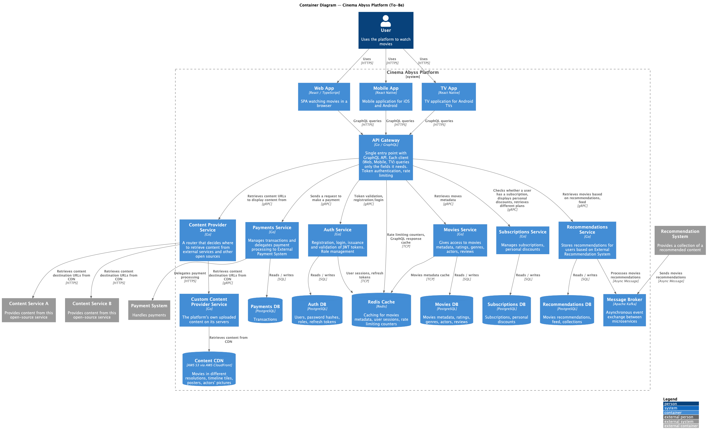
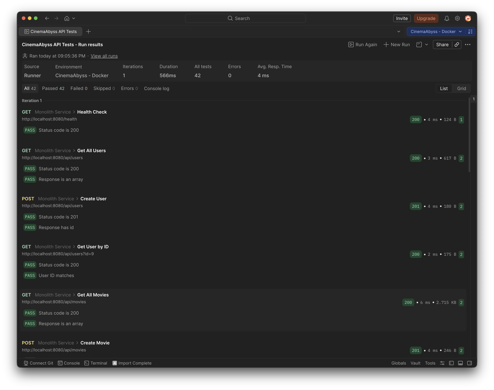
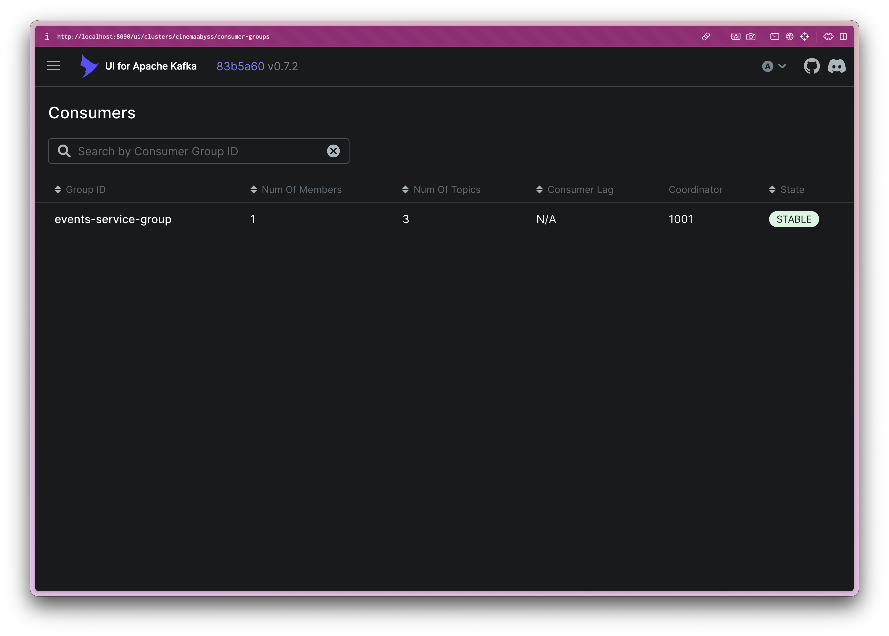
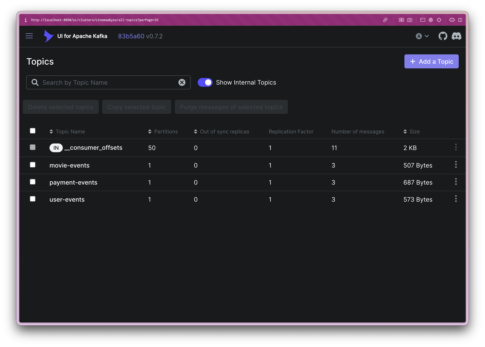
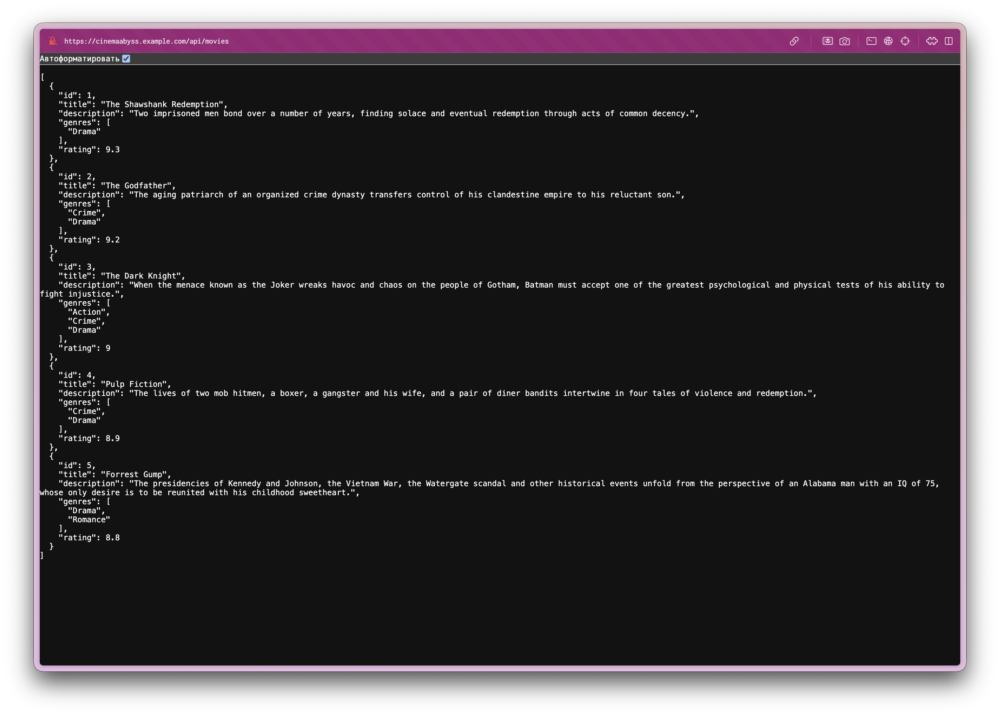
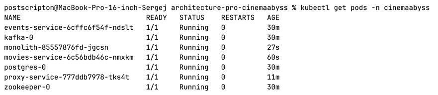
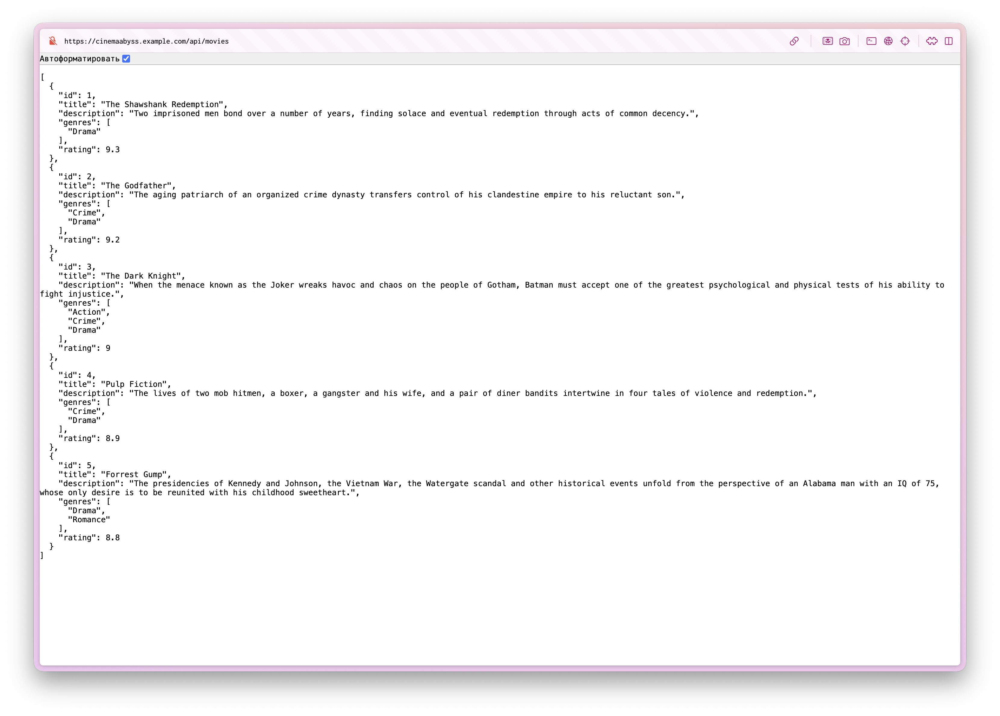
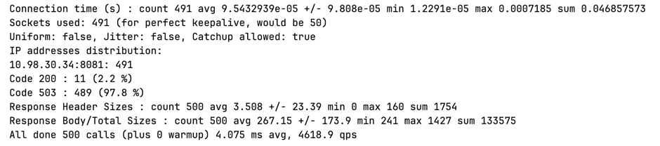
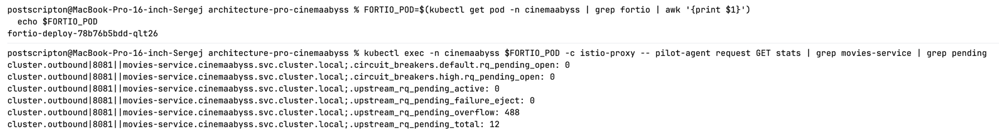

## Изучите [README.md](README.md) файл и структуру проекта.

## Задание 1

Спроектирована to-be архитектура КиноБездны. Система разделена на отдельные домены (микросервисы) с единой точкой входа (API Gateway) и асинхронным транспортом (Kafka). Каждый сервис владеет собственной базой данных (паттерн Database per Service).

Контейнерная диаграмма C4: [PlantUML](diagrams/c4_containers.puml)



### Домены

- **Auth Service** — регистрация, логин, выдача и валидация JWT-токенов, управление ролями. Хранит пользователей, хеши паролей, refresh-токены. Изолирует security-контекст от бизнес-логики.
- **Movies Service** — метаданные о фильмах: жанры, актёры, рейтинги, рецензии. Основной read-heavy сервис — первый кандидат на выделение из монолита по паттерну Strangler Fig.
- **Content Provider Service** — роутер контента — решает, откуда получить URL для стриминга: из собственного CDN (Custom Content Provider) или из внешних систем A/B. Абстрагирует клиентов от знания об источниках.
- **Custom Content Provider** — управляет собственным контентом платформы, загруженным на S3 и раздаваемым через AWS CloudFront CDN. Отделён от Content Provider для независимого масштабирования.
- **Recommendations Service** — хранит и отдаёт рекомендации, сформированные внешней рекомендательной системой. Получает данные асинхронно через Kafka — event-driven взаимодействие.
- **Subscriptions Service** — управление подписками, тарифными планами и персональными скидками. Определяет, какой контент доступен пользователю.
- **Payments Service** — управление транзакциями и делегирование процессинга внешней платёжной системе. Изолирует PCI DSS-критичную логику.

### Инфраструктурные компоненты

- **API Gateway (Go / GraphQL)** — единая точка входа с GraphQL API. Каждый клиент (Web, Mobile, TV) запрашивает только те поля, которые ему нужны, что решает проблему over-fetching для разных платформ (TV показывает меньше данных, мобильное приложение — другой набор полей). Аутентификация токенов через Auth Service, rate limiting. Все клиенты общаются только с ним.
- **Redis Cache** — in-memory кэш для снижения нагрузки на базы данных и ускорения ответов. Используется для: кэширования метаданных фильмов (read-heavy нагрузка), хранения пользовательских сессий и refresh-токенов, счётчиков rate limiting в API Gateway, кэширования GraphQL-ответов.
- **Apache Kafka** — асинхронная шина событий. Используется для получения рекомендаций от внешней системы, готова к расширению на события оплат, просмотров и аналитики.
- **Content CDN (AWS S3 + CloudFront)** — хранение и раздача контента: фильмы в разных разрешениях, постеры, фотографии актёров.

### Клиентские приложения

Три отдельных клиента для разных платформ с различающимися интерфейсами и объёмами данных:
- **Web App** (React / TypeScript) — SPA для браузера
- **Mobile App** (React Native) — мобильное приложение для iOS и Android
- **TV App** (React Native) — приложение для Smart TV

### Внешние системы

- **Payment System** — внешний платёжный процессинг
- **Content Service A / B** — внешние источники контента (открытые источники и партнёры)
- **Recommendation System** — сторонняя рекомендательная система, взаимодействие через Kafka

### Межсервисное взаимодействие

- **Клиент → Gateway**: GraphQL — каждый клиент запрашивает ровно те данные, которые ему нужны
- **Gateway → микросервисы**: gRPC — типизация через protobuf, бинарный протокол, мультиплексирование
- **Асинхронное**: Kafka для событий рекомендаций (eventual consistency)
- **Внешние вызовы**: HTTPS/REST к внешним системам

## Задание 2

### 1. Proxy
> Команда КиноБездны уже выделила сервис метаданных о фильмах movies и вам необходимо реализовать бесшовный переход с применением паттерна Strangler Fig в части реализации прокси-сервиса (API Gateway), с помощью которого можно будет постепенно переключать траффик, используя фиче-флаг.

Реализован прокси-сервис на Go (`src/microservices/proxy`) с использованием стандартного `net/http/httputil.ReverseProxy`.

Логика маршрутизации:
- Маршруты `/api/movies` и `/api/movies/*` - единственные, где активен фиче-флаг. При `GRADUAL_MIGRATION=true` каждый запрос случайно (через `rand.Intn(100)`) уходит в `movies-service` с вероятностью `MOVIES_MIGRATION_PERCENT` процентов, остальное - в монолит.
- Все остальные маршруты всегда проксируются в монолит.
- При `GRADUAL_MIGRATION=false` весь трафик идёт в монолит вне зависимости от `MOVIES_MIGRATION_PERCENT`.

Конфигурация загружается из переменных окружения:

```
PORT=8000
MONOLITH_URL=http://monolith:8080
MOVIES_SERVICE_URL=http://movies-service:8081
EVENTS_SERVICE_URL=http://events-service:8082
GRADUAL_MIGRATION=true
MOVIES_MIGRATION_PERCENT=50
```

### 2. Kafka
> Вам как архитектуру нужно также проверить гипотезу насколько просто реализовать применение Kafka в данной архитектуре.
> 
> Для этого нужно сделать MVP сервис events, который будет при вызове API создавать и сам же читать сообщения в топике Kafka.

Реализован сервис `events-service` на Go (`src/microservices/events`) с использованием библиотеки `github.com/IBM/sarama`.

Сервис поднимает в одном процессе и producer, и consumer group. При старте consumer подписывается на все три топика и пишет каждое входящее сообщение в лог.

API:

- `GET /api/events/health` - проверка работоспособности
- `POST /api/events/user` - публикует событие в топик `user-events`
- `POST /api/events/payment` - публикует событие в топик `payment-events`
- `POST /api/events/movie` - публикует событие в топик `movie-events`

Топики создаются автоматически при старте Kafka через `KAFKA_CREATE_TOPICS`. Consumer group `events-service-group` подписывается на все три топика и логирует каждое сообщение: топик, партицию, offset и тело.

Результаты прогона локальных тестов (проходят успешно):

```shell
┌─────────────────────────┬─────────────────┬─────────────────┐
│                         │        executed │          failed │
├─────────────────────────┼─────────────────┼─────────────────┤
│              iterations │               1 │               0 │
├─────────────────────────┼─────────────────┼─────────────────┤
│                requests │              22 │               0 │
├─────────────────────────┼─────────────────┼─────────────────┤
│            test-scripts │              22 │               0 │
├─────────────────────────┼─────────────────┼─────────────────┤
│      prerequest-scripts │               0 │               0 │
├─────────────────────────┼─────────────────┼─────────────────┤
│              assertions │              42 │               0 │
├─────────────────────────┴─────────────────┴─────────────────┤
│ total run duration: 2.7s                                    │
├─────────────────────────────────────────────────────────────┤
│ total data received: 9.6kB (approx)                         │
├─────────────────────────────────────────────────────────────┤
│ average response time: 7ms [min: 2ms, max: 39ms, s.d.: 7ms] │
└─────────────────────────────────────────────────────────────┘
Newman run completed!
Total requests: 22
Failed requests: 0
Total assertions: 42
Failed assertions: 0
```

Результаты Postman-тестов (проходят успешно, все зелёные):



Состояние consumer groups в Kafka UI после прогона тестов:



Состояние топиков в Kafka UI после прогона тестов:




## Задание 3

Команда начала переезд в Kubernetes для лучшего масштабирования и повышения надежности. 
Вам, как архитектору осталось самое сложное:
 - реализовать CI/CD для сборки прокси сервиса
 - реализовать необходимые конфигурационные файлы для переключения трафика.


### CI/CD

 В папке .github/worflows доработайте деплой новых сервисов proxy и events в docker-build-push.yml , чтобы api-tests при сборке отрабатывали корректно при отправке коммита в вашу новую ветку.

Нужно доработать 
```yaml
on:
  push:
    branches: [ main ]
    paths:
      - 'src/**'
      - '.github/workflows/docker-build-push.yml'
  release:
    types: [published]
```
и добавить необходимые шаги в блок
```yaml
jobs:
  build-and-push:
    runs-on: ubuntu-latest
    permissions:
      contents: read
      packages: write

    steps:
      - name: Checkout repository
        uses: actions/checkout@v3

      - name: Set up Docker Buildx
        uses: docker/setup-buildx-action@v2

      - name: Log in to the Container registry
        uses: docker/login-action@v2
        with:
          registry: ${{ env.REGISTRY }}
          username: ${{ github.actor }}
          password: ${{ secrets.GITHUB_TOKEN }}

```
Как только сборка отработает и в github registry появятся ваши образы, можно переходить к блоку настройки Kubernetes
Успешным результатом данного шага является "зеленая" сборка и "зеленые" тесты


### Proxy в Kubernetes

#### Шаг 1
Для деплоя в kubernetes необходимо залогиниться в docker registry Github'а.
1. Создайте Personal Access Token (PAT) https://github.com/settings/tokens . Создавайте class с правом read:packages
2. В src/kubernetes/*.yaml (event-service, monolith, movies-service и proxy-service)  отредактируйте путь до ваших образов 
```bash
 spec:
      containers:
      - name: events-service
        image: ghcr.io/ваш логин/имя репозитория/events-service:latest
```
3. Добавьте в секрет src/kubernetes/dockerconfigsecret.yaml в поле
```bash
 .dockerconfigjson: значение в base64 файла ~/.docker/config.json
```

4. Если в ~/.docker/config.json нет значения для аутентификации
```json
{
        "auths": {
                "ghcr.io": {
                       тут пусто
                }
        }
}
```
то выполните 

и добавьте

```json 
 "auth": "имя пользователя:токен в base64"
```

Чтобы получить значение в base64 можно выполнить команду
```bash
 echo -n ваш_логин:ваш_токен | base64
```

После заполнения config.json, также прогоните содержимое через base64

```bash
cat .docker/config.json | base64
```

и полученное значение добавляем в

```bash
 .dockerconfigjson: значение в base64 файла ~/.docker/config.json
```

#### Шаг 2

  Доработайте src/kubernetes/event-service.yaml и src/kubernetes/proxy-service.yaml

  - Необходимо создать Deployment и Service 
  - Доработайте ingress.yaml, чтобы можно было с помощью тестов проверить создание событий
  - Выполните дальшейшие шаги для поднятия кластера:

  1. Создайте namespace:
  ```bash
  kubectl apply -f src/kubernetes/namespace.yaml
  ```
  2. Создайте секреты и переменные
  ```bash
  kubectl apply -f src/kubernetes/configmap.yaml
  kubectl apply -f src/kubernetes/secret.yaml
  kubectl apply -f src/kubernetes/dockerconfigsecret.yaml
  kubectl apply -f src/kubernetes/postgres-init-configmap.yaml
  ```

  3. Разверните базу данных:
  ```bash
  kubectl apply -f src/kubernetes/postgres.yaml
  ```

  На этом этапе если вызвать команду
  ```bash
  kubectl -n cinemaabyss get pod
  ```
  Вы увидите

  NAME         READY   STATUS    
  postgres-0   1/1     Running   

  4. Разверните Kafka:
  ```bash
  kubectl apply -f src/kubernetes/kafka/kafka.yaml
  ```

  Проверьте, теперь должно быть запущено 3 пода, если что-то не так, то посмотрите логи
  ```bash
  kubectl -n cinemaabyss logs имя_пода (например - kafka-0)
  ```

  5. Разверните монолит:
  ```bash
  kubectl apply -f src/kubernetes/monolith.yaml
  ```
  6. Разверните микросервисы:
  ```bash
  kubectl apply -f src/kubernetes/movies-service.yaml
  kubectl apply -f src/kubernetes/events-service.yaml
  ```
  7. Разверните прокси-сервис:
  ```bash
  kubectl apply -f src/kubernetes/proxy-service.yaml
  ```

  После запуска и поднятия подов вывод команды 
  ```bash
  kubectl -n cinemaabyss get pod
  ```

  Будет наподобие такого

  NAME                              READY   STATUS    

  events-service-7587c6dfd5-6whzx   1/1     Running  

  kafka-0                           1/1     Running   

  monolith-8476598495-wmtmw         1/1     Running  

  movies-service-6d5697c584-4qfqs   1/1     Running  

  postgres-0                        1/1     Running  

  proxy-service-577d6c549b-6qfcv    1/1     Running  

  zookeeper-0                       1/1     Running 

  8. Добавим ingress

  - добавьте аддон
  ```bash
  minikube addons enable ingress
  ```
  ```bash
  kubectl apply -f src/kubernetes/ingress.yaml
  ```
  9. Добавьте в /etc/hosts
  127.0.0.1 cinemaabyss.example.com

  10. Вызовите
  ```bash
  minikube tunnel
  ```
  11. Вызовите https://cinemaabyss.example.com/api/movies
  Вы должны увидеть вывод списка фильмов
  Можно поэкспериментировать со значением   MOVIES_MIGRATION_PERCENT в src/kubernetes/configmap.yaml и убедится, что вызовы movies уходят полностью в новый сервис

  12. Запустите тесты из папки tests/postman
  ```bash
   npm run test:kubernetes
  ```
  Часть тестов с health-чек упадет, но создание событий отработает.
  Откройте логи event-service и сделайте скриншот обработки событий

#### Шаг 3

> Добавьте сюда скриншота вывода при вызове https://cinemaabyss.example.com/api/movies и скриншот вывода event-service после вызова тестов.

Вывод списка фильмов при вызове `https://cinemaabyss.example.com/api/movies`:



Логи events-service после прогона тестов:

```
2026-04-25T00:35:05.837831840Z 2026/04/25 00:35:05 producer connected to Kafka at [kafka:9092]
2026-04-25T00:35:05.837873882Z 2026/04/25 00:35:05 starting events-service on port 8082
2026-04-25T00:35:05.842605007Z 2026/04/25 00:35:05 consumer started, listening on topics: [user-events payment-events movie-events]
2026-04-25T01:06:10.576783009Z 2026/04/25 01:06:10 [producer] published movie event to topic=movie-events payload={"payload":{"action":"viewed","movie_id":6,"title":"Test Movie Event","user_id":4},"type":"movie"}
2026-04-25T01:06:10.611379092Z 2026/04/25 01:06:10 [consumer] topic=movie-events partition=0 offset=0 value={"payload":{"action":"viewed","movie_id":6,"title":"Test Movie Event","user_id":4},"type":"movie"}
2026-04-25T01:06:10.705977342Z 2026/04/25 01:06:10 [producer] published user event to topic=user-events payload={"payload":{"action":"logged_in","timestamp":"2026-04-25T01:06:10.692Z","user_id":4,"username":"testuser"},"type":"user"}
2026-04-25T01:06:10.710173342Z 2026/04/25 01:06:10 [consumer] topic=user-events partition=0 offset=0 value={"payload":{"action":"logged_in","timestamp":"2026-04-25T01:06:10.692Z","user_id":4,"username":"testuser"},"type":"user"}
2026-04-25T01:06:10.831175175Z 2026/04/25 01:06:10 [producer] published payment event to topic=payment-events payload={"payload":{"amount":9.99,"method_type":"credit_card","payment_id":4,"status":"completed","timestamp":"2026-04-25T01:06:10.819Z","user_id":4},"type":"payment"}
2026-04-25T01:06:10.833897384Z 2026/04/25 01:06:10 [consumer] topic=payment-events partition=0 offset=0 value={"payload":{"amount":9.99,"method_type":"credit_card","payment_id":4,"status":"completed","timestamp":"2026-04-25T01:06:10.819Z","user_id":4},"type":"payment"}
```


## Задание 4
Для простоты дальнейшего обновления и развертывания вам как архитектуру необходимо так же реализовать helm-чарты для прокси-сервиса и проверить работу 

Для этого:
1. Перейдите в директорию helm и отредактируйте файл values.yaml

```yaml
# Proxy service configuration
proxyService:
  enabled: true
  image:
    repository: ghcr.io/db-exp/cinemaabysstest/proxy-service
    tag: latest
    pullPolicy: Always
  replicas: 1
  resources:
    limits:
      cpu: 300m
      memory: 256Mi
    requests:
      cpu: 100m
      memory: 128Mi
  service:
    port: 80
    targetPort: 8000
    type: ClusterIP
```

- Вместо ghcr.io/db-exp/cinemaabysstest/proxy-service напишите свой путь до образа для всех сервисов
- для imagePullSecret проставьте свое значение (скопируйте из конфигурации kubernetes)
  ```yaml
  imagePullSecrets:
      dockerconfigjson: ewoJImF1dGhzIjogewoJCSJnaGNyLmlvIjogewoJCQkiYXV0aCI6ICJaR0l0Wlhod09tZG9jRjl2UTJocVZIa3dhMWhKVDIxWmFVZHJOV2hRUW10aFVXbFZSbTVaTjJRMFNYUjRZMWM9IgoJCX0KCX0sCgkiY3JlZHNTdG9yZSI6ICJkZXNrdG9wIiwKCSJjdXJyZW50Q29udGV4dCI6ICJkZXNrdG9wLWxpbnV4IiwKCSJwbHVnaW5zIjogewoJCSIteC1jbGktaGludHMiOiB7CgkJCSJlbmFibGVkIjogInRydWUiCgkJfQoJfSwKCSJmZWF0dXJlcyI6IHsKCQkiaG9va3MiOiAidHJ1ZSIKCX0KfQ==
  ```

2. В папке ./templates/services заполните шаблоны для proxy-service.yaml и events-service.yaml (опирайтесь на свою kubernetes конфигурацию - смысл helm'а сделать шаблоны для быстрого обновления и установки)

```yaml
template:
    metadata:
      labels:
        app: proxy-service
    spec:
      containers:
       Тут ваша конфигурация
```

3. Проверьте установку
Сначала удалим установку руками

```bash
kubectl delete all --all -n cinemaabyss
kubectl delete  namespace cinemaabyss
```
Запустите 
```bash
helm install cinemaabyss .\src\kubernetes\helm --namespace cinemaabyss --create-namespace
```
Если в процессе будет ошибка
```code
[2025-04-08 21:43:38,780] ERROR Fatal error during KafkaServer startup. Prepare to shutdown (kafka.server.KafkaServer)
kafka.common.InconsistentClusterIdException: The Cluster ID OkOjGPrdRimp8nkFohYkCw doesn't match stored clusterId Some(sbkcoiSiQV2h_mQpwy05zQ) in meta.properties. The broker is trying to join the wrong cluster. Configured zookeeper.connect may be wrong.
```

То пофиксть можно так:

```shell
kubectl delete pvc --all -n cinemaabyss
kubectl delete all --all -n cinemaabyss
kubectl delete namespace cinemaabyss
kubectl wait --for=delete namespace/cinemaabyss --timeout=60s
helm install cinemaabyss ./src/kubernetes/helm --namespace cinemaabyss --create-namespace
```

Проверьте развертывание:
```bash
kubectl get pods -n cinemaabyss
minikube tunnel
```

> Потом вызовите 
> https://cinemaabyss.example.com/api/movies
> и приложите скриншот развертывания helm и вывода https://cinemaabyss.example.com/api/movies

Развертывание через Helm (`kubectl get pods -n cinemaabyss`):



Вывод https://cinemaabyss.example.com/api/movies:



# Задание 5
Компания планирует активно развиваться и для повышения надежности, безопасности, реализации сетевых паттернов типа Circuit Breaker и канареечного деплоя вам как архитектору необходимо развернуть istio и настроить circuit breaker для monolith и movies сервисов.

```bash

helm repo add istio https://istio-release.storage.googleapis.com/charts
helm repo update

helm install istio-base istio/base -n istio-system --set defaultRevision=default --create-namespace
helm install istio-ingressgateway istio/gateway -n istio-system
helm install istiod istio/istiod -n istio-system --wait

helm install cinemaabyss .\src\kubernetes\helm --namespace cinemaabyss --create-namespace

kubectl label namespace cinemaabyss istio-injection=enabled --overwrite

kubectl get namespace -L istio-injection

kubectl apply -f .\src\kubernetes\circuit-breaker-config.yaml -n cinemaabyss

```

Тестирование

# fortio
```bash
kubectl apply -f https://raw.githubusercontent.com/istio/istio/release-1.25/samples/httpbin/sample-client/fortio-deploy.yaml -n cinemaabyss
```

# Get the fortio pod name
```bash
FORTIO_POD=$(kubectl get pod -n cinemaabyss | grep fortio | awk '{print $1}')

kubectl exec -n cinemaabyss $FORTIO_POD -c fortio -- fortio load -c 50 -qps 0 -n 500 -loglevel Warning http://movies-service:8081/api/movies
```
Например,

```bash
kubectl exec -n cinemaabyss fortio-deploy-b6757cbbb-7c9qg  -c fortio -- fortio load -c 50 -qps 0 -n 500 -loglevel Warning http://movies-service:8081/api/movies
```

Вывод будет типа такого

```bash
IP addresses distribution:
10.106.113.46:8081: 421
Code 200 : 79 (15.8 %)
Code 500 : 22 (4.4 %)
Code 503 : 399 (79.8 %)
```
Можно еще проверить статистику

```bash
kubectl exec -n cinemaabyss fortio-deploy-b6757cbbb-7c9qg -c istio-proxy -- pilot-agent request GET stats | grep movies-service | grep pending
```

И там смотрим 

```bash
cluster.outbound|8081||movies-service.cinemaabyss.svc.cluster.local;.upstream_rq_pending_total: 311 - столько раз срабатывал circuit breaker
You can see 21 for the upstream_rq_pending_overflow value which means 21 calls so far have been flagged for circuit breaking.
```

Приложите скриншот работы circuit breaker'а

---

Результаты нагрузочного теста fortio (50 параллельных воркеров, 500 запросов):



```
Code 200 : 11 (2.2 %)
Code 503 : 489 (97.8 %)
```

Circuit breaker отсёк 97.8% запросов - из 500 только 11 дошли до `movies-service`. Остальные 489 получили мгновенный 503 от envoy sidecar, не нагрузив сервис.

Статистика envoy после теста (`upstream_rq_pending_overflow` - счётчик срабатываний circuit breaker):



```
cluster.outbound|8081||movies-service.cinemaabyss.svc.cluster.local;.upstream_rq_pending_overflow: 488
cluster.outbound|8081||movies-service.cinemaabyss.svc.cluster.local;.upstream_rq_pending_total: 12
```

`upstream_rq_pending_overflow: 488` подтверждает количество запросов, отклонённых circuit breaker'ом. `upstream_rq_pending_total: 12` - столько запросов реально попали в очередь и были отправлены к сервису.

---

Удаляем все
```bash
istioctl uninstall --purge
kubectl delete namespace istio-system
kubectl delete all --all -n cinemaabyss
kubectl delete namespace cinemaabyss
```
